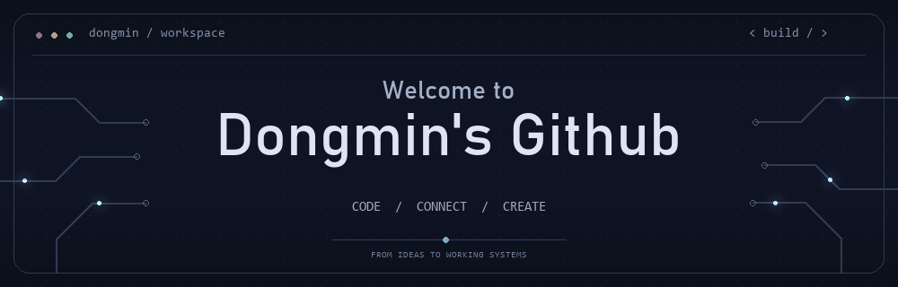

  

## 👋 About Me

애플리케이션, 실시간 3D, 임베디드와 로봇 등 다양한 분야의 프로젝트를 개발하고 있습니다.

- 💻 **Focus**: 소프트웨어 구현과 시스템 연동
- 🧩 **Identity**: 기능 사이의 관계와 흐름을 정리하고, 변화에 유연하게 대응할 수 있는 로직을 설계하는 개발자
- 🔧 **Interests**: 시스템 구조 설계, 상태 기반 제어 로직, 하드웨어·소프트웨어 연동

---

 

## 🛠️ Tech Stack & Tools

### Languages

### Robotics & Embedded Systems

### Real-Time 3D Engine

### GUI & Windows Development

### Graphics & Computer Vision

### Development Environment

### Collaboration Tools

---

 

## 🚀 Featured Projects

### 🤖 다중 로봇 협업 기반 스마트팜 자동화 시스템

> 예찰 로봇이 수확할 작물과 작업 위치를 찾고, 수확·이송 로봇과 선별 시스템이 협업하는 스마트팜 자동화 프로젝트

- **Period**: 2026.09 – Present
- **Team**: 7명
- **Status**: 개발 및 통합 테스트 진행 중
- **Role**: 예찰 로봇 자율주행, FSM 설계, 로봇 소프트웨어 구조화·통합
- **Stack**:
  
  
  
  
  
  
  
- **Highlights**:
  - TurtleBot 기반 Nav2·Route Server 경로 주행 구성 및 주행 파라미터 튜닝
  - AMCL·Odometry·TF를 활용한 위치 추정 및 좌표계 연동
  - 이동·예찰·작업 완료 등 로봇 동작을 관리하는 FSM 설계
  - 로봇별 기능과 공통 로직의 역할을 나누고, 상태·데이터 흐름을 연결하는 소프트웨어 구조 설계 및 통합
  - 예찰 결과를 수확 로봇의 목표 작업 위치로 연결하는 로직 개발

---

### 🔌 KICK-CAN | STM32 분산 임베디드 RC카 시스템

> RFID 인증 기반 무선 Controller와 CAN 차량 네트워크를 연결한 4-Node 시스템

- **Period**: 2026.07.23 – 2026.07.30
- **Team**: 4명
- **Role**: STM32F411 기반 Controller 하드웨어 구성 및 펌웨어 개발
- **Stack**:
  
  
  
  
  
  
  
  
- **Highlights**:
  - RFID 인증에 따른 주변장치 전원 제어와 패킷 송신 차단을 결합한 이중 인터락
  - ADC Circular DMA와 EMA·Dead Zone을 활용한 조이스틱 입력 안정화
  - 스위치 디바운싱과 인증·입력·송신 기능 분리
  - Main Node와 제어 패킷 규약 협의 및 실제 차량 연동

※ Controller는 Bluetooth로 Main Node와 통신하며, 차량 내부 노드는 CAN Bus로 연결됩니다.

[📂 Repository](https://github.com/Dongmins11/KickCAN_project_Controller)

---

### 🖥️ POCO | AI 자세 코칭 모니터암

> 사용자 자세를 분석하고, 정상 자세에서 모니터 위치와 수평을 자동으로 조절하는 시스템

- **Team**: 4명
- **Role**: 프론트엔드·백엔드, 모니터암 수평제어, 멀티프로세싱·자원 최적화, 성능지표 설계·분석
- **Stack**:
  
  
  
  
  
  
- **Highlights**:
  - 사용자 프로필·보정·측정 과정을 연결한 UI와 실행 흐름 구성
  - IMU 기반 모니터암 수평제어 참여
  - 비전 처리와 하드웨어 제어를 분리한 멀티프로세싱 구조 적용
  - 최신 프레임을 우선 처리하도록 변경하여 버퍼 누적과 자세 판단 지연 개선
  - 시스템 성능 측정 및 결과 분석

[📂 Repository](https://github.com/Dongmins11/POCO)
· [📄 Report](https://drive.google.com/file/d/16OyNF7ngtve8rrRyiLknU3rjZ7oI_OXE/view)
· [🎬 Demo](https://youtu.be/UHQtAFz2T6M)

---

## 📂 Other Projects

| Project | Highlights | Stack |
|---|---|---|
| PLC 자동화 공정 시스템 | 소재 분류·적재 시스템의 배출 시퀀스, 선택·전체 배출 및 인터락 구현 |    |
| Unity 모바일 인디게임 | 3인 팀에서 게임 전체 프로그래밍을 맡아 모바일 출시 |    |
| Defengo: 랜덤 디펜스 게임 라이브서비스 | Unity 모바일 게임의 캐릭터·퀘스트·상점 등 콘텐츠 개발, 서버 API 연동 및 결제·광고 오류 개선 |    |
| DirectX / WinAPI 게임 제작 | 2D 슈팅·3D 액션·방탈출 게임의 캐릭터 조작, 전투·퍼즐 및 맵 편집기 구현 |     |

 

---

<!--
**Dongmins11/Dongmins11** is a ✨ _special_ ✨ repository because its `README.md` (this file) appears on your GitHub profile.

Here are some ideas to get you started:

- 🔭 I’m currently working on ...
- 🌱 I’m currently learning ...
- 👯 I’m looking to collaborate on ...
- 🤔 I’m looking for help with ...
- 💬 Ask me about ...
- 📫 How to reach me: ...
- 😄 Pronouns: ...
- ⚡ Fun fact: ...
-->
